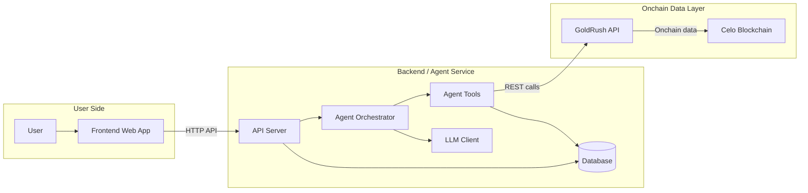

# Product Requirement Document (PRD): Celalyze

**Nama Produk:** Celalyze  
**Tagline:** Onchain Tax & Portfolio Agent for Celo  
**Versi:** 1.0 (Hackathon MVP)  
**Status:** Approved  
**Tanggal:** 22 Juli 2026  

---

## 1. Ringkasan Eksekutif & Visi Produk

### 1.1 Problem Statement
Melakukan kalkulasi Profit and Loss (PnL) serta menentukan kewajiban pajak pada ekosistem onchain Celo sering kali membingungkan pengguna. Aktivitas DeFi seperti token swap, yield farming, staking, transfer antar wallet, dan penerimaan airdrop memerlukan kategorisasi manual yang rumit. Data transaksi mentah dari *blockchain explorer* juga sangat sulit diinterpretasikan tanpa konteks finansial yang jelas.

### 1.2 Solusi
**Celalyze** hadir sebagai *AI Agent* analitis berbasis read-only yang secara otomatis membaca histori transaksi wallet di Celo Mainnet. Celalyze mengklasifikasikan setiap transaksi berdasarkan kategorisasi pajak, menghitung PnL terrealisasi (realized) maupun belum terrealisasi (unrealized), serta memberikan insight komprehensif melalui *interactive dashboard*, halaman laporan pajak terstruktur, dan fitur *interactive AI chat*.

### 1.3 Scope Hackathon & Alignment Track
Untuk cakupan MVP Hackathon, Celalyze difokuskan sebagai **read-only agent** (analitik & *reporting*, tanpa eksekusi transaksi/trade otomatis). Produk ini dioptimalkan khusus untuk:
* **Track 3 (Askbots):** Integrasi AI Agent yang mampu menjawab pertanyaan kompleks seputar portofolio dan pajak onchain secara *natural language*.
* **Track 4 (Aigora):** Penerapan arsitektur agentic yang rapi, transparan, dan dapat dievaluasi (*evals*).

---

## 2. Target Pengguna & Use Cases

### 2.1 Target Persona
1. **Celo DeFi User / Trader / Yield Farmer:** Pengguna aktif di ekosistem Celo yang membutuhkan laporan PnL transparan dan estimasi dampak pajak atas aktivitas trading & yield.
2. **Web3 Auditor / Accountant:** Profesional atau individu yang membutuhkan rekap transaksi onchain terurut dengan kategori yang akurat dan dapat diexport.
3. **Hackathon Judges & Builders:** Penilai dan pengembang yang ingin melihat contoh konkret implementasi *AI agent* analitik berbasis data onchain Celo yang modular dan berkinerja tinggi.

### 2.2 Core Use Cases
* **UC-01:** *"Menganalisis histori transaksi wallet Celo untuk tahun pajak berjalan."*
* **UC-02:** *"Penjelasan rinci mengenai keuntungan (gains) dan kerugian (losses) yang telah terrealisasi."*
* **UC-03:** *"Identifikasi transaksi mana saja yang dikenakan pajak (taxable) beserta alasan kategorisasinya."*
* **UC-04:** *"Fitur koreksi label secara manual oleh pengguna jika terdapat klasifikasi transaksi yang kurang akurat."*
* **UC-05:** *"Konsultasi portofolio & pertanyaan pajak secara kontekstual melalui AI Chat."*

---

## 3. Spesifikasi Fitur Utama (Core Features)

### 3.1 Dashboard Page (`/dashboard`)
* **Overview Metrics:** Total Portfolio Value (USD/IDR), Total Realized PnL, Total Unrealized PnL, Total Taxable Income.
* **Portfolio Chart:** Grafik visualisasi histori nilai portofolio dari waktu ke waktu.
* **Recent Activity & Tax Highlights:** Ringkasan singkat transaksi *taxable* terbaru dan estimasi kewajiban pajak.

### 3.2 Tax Reports Page (`/tax-reports`)
* **Filter Periode:** Filter berdasarkan Tahun Pajak (misal: 2025, 2026) atau kustom rentang tanggal.
* **Taxable Breakdown:**
  * Capital Gains / Losses (Short-term & Long-term).
  * Ordinary Income (Yield Farming, Staking Rewards, Airdrop, Salary/Grant).
* **Export Functionality:** Export laporan ke format **CSV** dan **PDF** terformat rapi untuk keperluan audit/pajak.

### 3.3 History & Labeling Page (`/history`)
* **Transaction Table:** Menampilkan daftar transaksi onchain Celo per wallet (Tx Hash, Timestamp, Method/Action, Amount, Token, Kategori Pajak, Confidence Score).
* **Kategori Pajak:** `Income`, `Capital Gain/Loss (Swap)`, `Transfer (Non-Taxable)`, `Yield/Staking Reward`, `Airdrop`, `Gas Fee`.
* **AI Confidence Score:** Indikator tingkat kepastian klasifikasi AI (misal: 95% High, 60% Low).
* **UI Manual Correction:** Antarmuka bagi pengguna untuk mengganti label jika AI salah mengklasifikasi. Hasil koreksi disimpan ke Database untuk meningkatkan akurasi *feedback loop*.

### 3.4 Settings & Wallet Page (`/settings`)
* **Wallet Management:** Input & kelola alamat wallet Celo (`0x...`).
* **Preferensi Pajak & Portofolio:** Pemilihan mata uang (*Fiat currency*: USD, EUR, IDR) dan standar/wilayah perpajakan (*Tax Region*).
* **Agent Mode:** Informasi mode agent (`Read-Only` untuk MVP).

### 3.5 Interactive AI Chat Page (`/chat`)
* **Natural Language Q&A:** Chatbot berbasis RAG (*Retrieval-Augmented Generation*) di atas data PnL dan transaksi pengguna.
* **Prompt Suggestions:** Contoh pertanyaan cepat seperti *"Berapa total realized gain saya di Q2?"* atau *"Apakah klaim airdrop bulan lalu masuk taxable income?"*.
* **Response Feedback:** Tombol *Thumbs Up / Thumbs Down* pada setiap jawaban untuk evaluasi performa *Askbots*.

### 3.6 Desain UI/UX & Sistem Warna (Design System)
* **Primary Color:** `#FCFF51` (Vibrant Celo Yellow) — Digunakan untuk aksen utama, tombol aksi utama (*primary CTA*), sorotan indikator aktif, dan elemen *branding* kunci.
* **Secondary / Background Color:** `#FCF6F1` (Warm Soft Cream) — Digunakan sebagai warna latar belakang halaman utama (*page canvas/background*), memberikan tampilan yang bersih, hangat, dan nyaman dilihat.
* **Tipografi & Font:**
  * **Default / Primary Sans-Serif Font:** `Inter` — Digunakan untuk *body text*, antarmuka aplikasi (*UI elements*), tabel transaksi, navigasi, dan tombol demi keterbacaan (*readability*) yang optimal.
  * **Secondary / Brand Serif Font (Khusus Titles & Headings):** `GT Alpina Thin` & `GT Alpina Thin Italic` (Default weight: `400`).
    * **Contoh Penggunaan:**
      * **Page Title / Hero Title:** *"Celalyze: Onchain Tax & Portfolio Agent"* (`font-family: 'GT Alpina Thin', serif; font-weight: 400;`)
      * **Section Headings (H1, H2, H3):** Judul halaman Dashboard, Tax Reports, History, dan Chat.
      * **Card Title & Metrics Highlights:** *"Realized Capital Gains"*, *"Taxable Income Overview"*.
    * **Contoh Penerapan CSS:**
      ```css
      /* Styling untuk Title/Heading dengan GT Alpina */
      h1, h2, h3, .page-title, .hero-title {
        font-family: 'GT Alpina Thin', 'GT Alpina', Georgia, serif;
        font-weight: 400;
        letter-spacing: -0.02em;
      }

      /* Italic Accent pada Title */
      .hero-title span.accent {
        font-family: 'GT Alpina Thin Italic', 'GT Alpina', Georgia, serif;
        font-style: italic;
      }
      ```
* **Text & Neutral Contrast:**
  * Dark Neutral (`#1E1E1E` / `#111827`) untuk teks utama, judul, dan *border* kontras tinggi agar rasio kontras warna keterbacaan (WCAG AAA) terpenuhi di atas warna `#FCFF51` dan `#FCF6F1`.
  * Card Background (`#FFFFFF`) di atas latar belakang `#FCF6F1`.
* **Aturan Border Radius & Bentuk Komponen (Shapes & Rounding):**
  * **Full Rounded (`rounded-full` / Pill Shape):** Digunakan untuk semua elemen interaktif kecil dan badge, seperti **Button**, **Pill**, **Badge**, **Chip / Tag**, **Search Input Bar**, **Confidence Score Pills**, dan **Status Indicator**.
  * **Sharp / Rounded None (`rounded-none` / 0px radius):** Digunakan untuk semua wadah utama, seperti **Card Container**, **Panels**, **Data Tables**, **Modals**, **Sidebar**, dan **Section Blocks** (desain *sharp-edge container* kontras dengan *pill-shaped elements*).
* **Aset & Estetika Visual:** Menggunakan antarmuka modern *light theme* berestetika hangat dengan kontras tinggi antara wadah tegas (*sharp cards*) dan elemen interaktif melengkung halus (*full rounded buttons & pills*).

---

## 4. Arsitektur Sistem & Spesifikasi AI Agent

### 4.1 Tech Stack
* **Frontend:** Next.js (React), Tailwind CSS / Vanilla CSS, Lucide Icons, Recharts (Charts).
* **Backend Service:** Node.js (Express/Fastify) atau Python (FastAPI).
* **Agent Orchestrator:** LangChain / LangGraph (mengelola interaksi antara LLM dan deterministic tools).
* **LLM Engine:** OpenAI GPT-4o / Claude 3.5 Sonnet (reasoning & penjelasan natural language).
* **Data Provider:** GoldRush API (Covalent) untuk fetching balances dan transaction history Celo (`celo-mainnet`).
* **Database:** PostgreSQL / MongoDB (menyimpan data wallet, label koreksi, laporan pajak, dan sesi chat).

### 4.2 Spesifikasi Agent Tools
Agent bekerja secara analitis (*read-only*) dengan mengeksekusi *deterministic tools* berikut:

1. `get_wallet_overview(wallet_address)`  
   *Mengambil data saldo token, nilai portofolio, dan alokasi aset via GoldRush API.*
2. `get_wallet_history(wallet_address, start_date, end_date)`  
   *Mengambil seluruh histori transaksi Celo mainnet dalam rentang waktu tertentu.*
3. `classify_transactions(raw_transactions)`  
   *Mengkombinasikan rule-based engine dan LLM untuk memberi label kategori pajak & confidence score pada tiap transaksi.*
4. `build_tax_report(classified_transactions, tax_rules)`  
   *Kalkulasi angka PnL terrealisasi, capital gain/loss, dan total taxable income.*
5. `summarize_insights(tax_report_data, query)`  
   *Menerjemahkan kalkulasi finansial menjadi penjelasan natural language yang mudah dipahami.*

### 4.3 Endpoint API Specs (Backend)

| Method | Endpoint | Deskripsi |
| :--- | :--- | :--- |
| `POST` | `/api/v1/analyze-wallet` | Memicu analisis awal wallet (fetch GoldRush, klasifikasi, & simpan DB). |
| `GET` | `/api/v1/tax-report` | Mengambil data rekap laporan pajak berdasarkan wallet & tahun. |
| `GET` | `/api/v1/history` | Mengambil daftar transaksi terklasifikasi dengan opsi pagination & filter. |
| `POST` | `/api/v1/history/correct` | Mengupdate label transaksi secara manual oleh pengguna. |
| `POST` | `/api/v1/chat` | Mengirim pertanyaan pengguna ke AI Chat Agent dengan konteks data wallet. |
| `GET` | `/api/v1/settings` | Mengambil & mengupdate preferensi pengguna (fiat currency, tax region). |

---

## 5. Alur Interaksi System (Interaction Flow)



1. **Flow "Analyze Wallet":** User memasukkan alamat wallet -> Backend memanggil GoldRush API -> Agent mengklasifikasikan transaksi & menghitung PnL -> Hasil disimpan di DB -> Dashboard menampilkan ringkasan.
2. **Flow "Tax Report & Export":** User memilih filter tahun -> Backend mengambil data dari DB -> Menampilkan breakdown pajak -> User menekan tombol Export CSV/PDF.
3. **Flow "Label Correction":** User melihat transaksi di Halaman History -> Mengubah label -> Backend memperbarui DB -> Rekalkulasi PnL dilakukan secara instan.
4. **Flow "AI Chat Consultation":** User mengajukan pertanyaan -> Agent mengambil konteks data portofolio dari DB -> LLM menyusun jawaban kontekstual -> Jawaban ditampilkan di UI Chat.

---

## 6. Guardrails, Safety, & Kriteria Evaluasi

### 6.1 Guardrails & Keamanan
* **Read-Only Scope:** Agent **TIDAK MEMILIKI** private key atau izin akses untuk mengeksekusi transaksi *write/send* onchain.
* **API Key Protection:** Seluruh API Key (GoldRush, LLM provider) disimpan secara aman di environment variabel backend (`.env`).
* **Input Validation:** Sanitasi alamat wallet Ethereum/Celo (`0x...`) sebelum diproses oleh sistem.

### 6.2 Evaluasi Performa (Evals)
* **Labeling Accuracy Rate:** Persentase transaksi yang berhasil diklasifikasikan dengan benar oleh AI pada percobaan pertama.
* **PnL Math Consistency:** Memastikan perhitungan PnL terrealisasi konsisten dengan data harga historis.
* **Chat Answer Relevance:** Pengukuran kepuasan pengguna melalui rating feedback (*thumbs up/down*) pada fitur Askbots.

---

## 7. Roadmap Masa Depan (v2 Ideas)

1. **ERC-8004 Agent Registration:** Registrasi Celalyze secara resmi sebagai Agentic Entity terverifikasi pada jaringan Celo.
2. **Aigora Feedback Loop:** Integrasi telemetri dan sistem evaluasi performa agent berbasis komunitas Aigora.
3. **Onchain Tax Snapshot:** Menyediakan fitur opsional bagi user untuk mempublikasikan hash bukti (*proof*) laporan pajak ke smart contract Celo.
4. **Multi-Chain Support:** Ekspansi cakupan analitik ke jaringan EVM Layer-2 lainnya (seperti Base, Arbitrum) dengan tetap menjadikan Celo sebagai *primary chain*.
