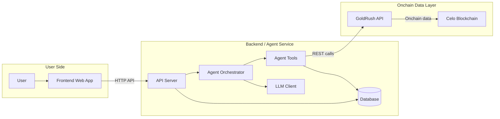

# Product Requirement Document (PRD): Celalyze

**Product Name:** Celalyze  
**Tagline:** Onchain Tax & Portfolio Agent for Celo  
**Version:** 1.0  
**Status:** Approved  
**Date:** July 22, 2026  

---

## 1. Executive Summary & Product Vision

### 1.1 Problem Statement
Calculating Profit and Loss (PnL) and determining tax obligations in the Celo onchain ecosystem is often complex and confusing for users. DeFi activities such as token swaps, yield farming, staking, transfers between wallets, and airdrop receipts require tedious manual categorization. Raw transaction data from blockchain explorers is difficult to interpret without clear financial context.

### 1.2 Solution
**Celalyze** is an analytical, read-only AI Agent that automatically indexes wallet transaction history on Celo Mainnet. Celalyze classifies each transaction into tax categories, calculates both realized and unrealized PnL, and provides comprehensive financial insights through an interactive dashboard, structured tax report pages, and an interactive AI chat interface.

---

## 2. Target Users & Use Cases

### 2.1 Target Personas
1. **Celo DeFi Users / Traders / Yield Farmers:** Active users in the Celo ecosystem requiring transparent PnL accounting and tax impact estimates for their trading and yield activities.
2. **Web3 Auditors / Accountants:** Professionals or individuals needing chronological, accurately categorized, and exportable onchain transaction records.
3. **DeFi Analysts & Ecosystem Participants:** Evaluators and developers looking for a high-performance, modular analytical AI agent operating on Celo onchain data.

### 2.2 Core Use Cases
* **UC-01:** *"Analyze Celo wallet transaction history for the selected tax year."*
* **UC-02:** *"View a detailed breakdown of realized gains and losses."*
* **UC-03:** *"Identify taxable transactions along with clear classification rationales."*
* **UC-04:** *"Manually correct transaction labels to refine and train categorization accuracy."*
* **UC-05:** *"Consult portfolio metrics and tax questions contextually using the AI Chat Agent."*

---

## 3. Core Feature Specifications

### 3.1 Dashboard Page (`/dashboard`)
* **Overview Metrics:** Total Portfolio Value (USD/EUR/IDR), Total Realized PnL, Total Unrealized PnL, Total Taxable Income.
* **Portfolio Chart:** Visual chart tracking portfolio historical performance over time.
* **Recent Activity & Tax Highlights:** Summary of recent taxable transactions and estimated tax liabilities.

### 3.2 Tax Reports Page (`/tax-reports`)
* **Period Filter:** Filter by Tax Year (e.g., 2025, 2026) or custom date range.
* **Taxable Breakdown:**
  * Capital Gains / Losses (Short-term & Long-term).
  * Ordinary Income (Yield Farming, Staking Rewards, Airdrops, Salary/Grants).
* **Export Functionality:** Export reports into clean **CSV** (IRS Form 8949 format) and **PDF** formats for accounting and auditing purposes.

### 3.3 History & Labeling Page (`/history`)
* **Transaction Table:** Displays Celo onchain transactions per wallet (Tx Hash, Timestamp, Method/Action, Amount, Token, Tax Category, Confidence Score).
* **Tax Categories:** `Income`, `Capital Gain/Loss (Swap)`, `Transfer (Non-Taxable)`, `Yield/Staking Reward`, `Airdrop`, `Gas Fee`.
* **AI Confidence Score:** Indicates classification certainty (e.g., 95% High, 60% Low).
* **UI Manual Correction:** Allows users to adjust labels if misclassified. Corrections are stored in the database to improve model accuracy via a continuous feedback loop.

### 3.4 Settings & Wallet Page (`/settings`)
* **Wallet Management:** Input and manage Celo wallet addresses (`0x...`).
* **Tax & Portfolio Preferences:** Selection of fiat currency (USD, EUR, IDR) and tax jurisdiction/accounting standard (FIFO, LIFO, HIFO).
* **Agent Mode:** Indicates current agent mode (`Read-Only`).

### 3.5 Interactive AI Chat Page (`/chat`)
* **Natural Language Q&A:** RAG-powered (Retrieval-Augmented Generation) AI Assistant operating over user PnL and transaction datasets.
* **Prompt Suggestions:** One-click queries such as *"What were my net realized gains in Q2?"* or *"Was my airdrop claim last month taxable?"*.
* **Response Feedback:** Thumbs Up / Thumbs Down feedback mechanism on responses for agent quality evaluation.

### 3.6 UI/UX & Design System Specifications
* **Primary Color:** `#FCFF51` (Vibrant Celo Yellow) — Used for primary CTAs, active indicators, brand accents, and focused states.
* **Secondary / Background Color:** `#FCF6F1` (Warm Soft Cream) — Main page canvas background color providing a warm, clean, high-contrast visual surface.
* **Typography Hierarchy:**
  * **Default / Primary Sans-Serif Font:** `Inter` — Used for body text, UI components, data tables, navigation, inputs, and buttons for optimal legibility.
  * **Secondary / Brand Serif Font (Titles & Headings):** `GT Alpina Thin` & `GT Alpina Thin Italic` (Default weight: `400`).
    * **Usage Examples:**
      * **Page Title / Hero Title:** *"Celalyze: Onchain Tax & Portfolio Agent"* (`font-family: 'GT Alpina Thin', serif; font-weight: 400;`)
      * **Section Headings (H1, H2, H3):** Dashboard, Tax Reports, History, and Chat titles.
      * **Card Titles & Metric Highlights:** *"Realized Capital Gains"*, *"Taxable Income Overview"*.
    * **CSS Implementation:**
      ```css
      h1, h2, h3, .page-title, .hero-title {
        font-family: 'GT Alpina Thin', 'GT Alpina', Georgia, serif;
        font-weight: 400;
        letter-spacing: -0.02em;
      }

      .hero-title span.accent {
        font-family: 'GT Alpina Thin Italic', 'GT Alpina', Georgia, serif;
        font-style: italic;
      }
      ```
* **Text & Neutral Contrast:**
  * Dark Neutral (`#1E1E1E` / `#111827`) for body text, headings, and high-contrast borders to satisfy WCAG AAA contrast standards over `#FCFF51` and `#FCF6F1`.
  * Card Background (`#FFFFFF`) set over `#FCF6F1` canvas.
* **Border Radius & Component Shapes:**
  * **Full Rounded (`rounded-full` / Pill Shape):** Applied to all small interactive elements and badges: Buttons, Pills, Badges, Chips/Tags, Search Input Bars, Confidence Score Badges, and Status Indicators.
  * **Sharp / Rounded None (`rounded-none` / 0px radius):** Applied to structural containers: Card Containers, Panels, Data Tables, Modals, Sidebars, and Section Blocks (high visual contrast between sharp containers and smooth pill controls).

---

## 4. System Architecture & AI Agent Specs

### 4.1 Tech Stack
* **Frontend:** Next.js (React), Tailwind CSS / Vanilla CSS, Lucide Icons, Recharts.
* **Backend Service:** Node.js (Express/Fastify) or Python (FastAPI).
* **Agent Orchestrator:** LangChain / LangGraph (coordinating LLM reasoning with deterministic tools).
* **LLM Engine:** OpenAI GPT-4o / Claude 3.5 Sonnet (reasoning and natural language synthesis).
* **Data Provider:** GoldRush API (Covalent) for fetching Celo token balances and transaction history (`celo-mainnet`).
* **Database:** PostgreSQL / MongoDB (storing user wallets, manual label overrides, tax reports, and chat sessions).

### 4.2 Agent Tools Specifications
The agent operates in a strict read-only analytical mode by calling deterministic tools:

1. `get_wallet_overview(wallet_address)`  
   *Fetches token balances, portfolio value, and asset allocations via GoldRush API.*
2. `get_wallet_history(wallet_address, start_date, end_date)`  
   *Fetches raw Celo mainnet transaction history within the specified date range.*
3. `classify_transactions(raw_transactions)`  
   *Combines a rule-based engine with LLM classification to assign tax categories and confidence scores to each transaction.*
4. `build_tax_report(classified_transactions, tax_rules)`  
   *Calculates realized PnL, capital gains/losses, and total taxable income.*
5. `summarize_insights(tax_report_data, query)`  
   *Translates financial calculations into natural language summaries.*

### 4.3 API Endpoint Specs (Backend)

| Method | Endpoint | Description |
| :--- | :--- | :--- |
| `POST` | `/api/v1/analyze-wallet` | Triggers initial wallet indexing (GoldRush fetch, classification, & DB save). |
| `GET` | `/api/v1/tax-report` | Retrieves tax report breakdown for a specific wallet and year. |
| `GET` | `/api/v1/history` | Fetches paginated transaction history with tax labels and confidence scores. |
| `POST` | `/api/v1/history/correct` | Submits manual user label corrections to update DB and recalculate PnL. |
| `POST` | `/api/v1/chat` | Submits natural language queries to the AI Chat Agent with wallet context. |
| `GET` | `/api/v1/settings` | Gets and updates user preferences (fiat currency, tax region). |

---

## 5. System Interaction Flow



1. **"Analyze Wallet" Flow:** User inputs wallet address -> Backend calls GoldRush API -> Agent classifies transactions & computes PnL -> Saved to DB -> Dashboard displays metrics.
2. **"Tax Report & Export" Flow:** User selects year filter -> Backend fetches data from DB -> Displays tax breakdown -> User exports CSV/PDF.
3. **"Label Correction" Flow:** User updates category on History Page -> Backend updates DB -> Instant PnL recalculation.
4. **"AI Chat Consultation" Flow:** User asks question -> Agent retrieves wallet data context from DB -> LLM formulates response -> Answer rendered in Chat UI.

---

## 6. Guardrails, Safety, & Evaluation Metrics

### 6.1 Guardrails & Security
* **Read-Only Scope:** The agent **NEVER** requests, stores, or handles private keys or transaction execution permissions.
* **API Key Protection:** All API keys (GoldRush, LLM providers) are stored in server-side environment variables (`.env`).
* **Input Validation:** EVM/Celo wallet addresses (`0x...` 40-character hex) are strictly validated before processing.

### 6.2 Evaluation Metrics
* **Labeling Accuracy Rate:** Percentage of transactions correctly classified on the first pass.
* **PnL Math Consistency:** Deterministic calculation accuracy verified against historical price feeds.
* **Chat Answer Relevance:** User satisfaction measured via response feedback mechanisms.

---

## 7. Smart Contracts & Deployment Status

Celalyze has deployed two smart contracts on **Celo Mainnet** (Chain ID: `42220`), verified on Sourcify:

1. **`AgentRegistry`** (`0x60EeCE2904bBF0f4B8eD4ec35cD69658cAFeE1da`): Registers identity and capabilities of Celalyze as **Agent ID `0`** on Celo Mainnet.
2. **`TaxReportAttestation`** (`0xB21D6470363e7d2E4a75d5386fA369E9FcB5BA6f`): Enables onchain attestation and verification of `keccak256` tax report hashes.

---

## 8. Future Roadmap

1. **Community Telemetry & Performance Feedback:** Enhanced telemetry and automated feedback loops for agent performance evaluation.
2. **Multi-Chain Expansion:** Expanding analytical support to additional EVM Layer-2 networks (e.g., Base, Arbitrum) while retaining Celo as the primary ecosystem hub.
