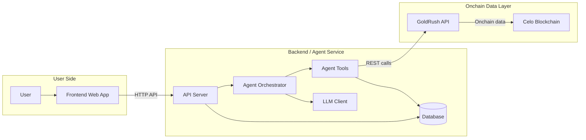

# Celalyze

**Onchain Tax & Portfolio Agent for Celo**

Celalyze is a read-only AI agent that automatically reads your Celo Mainnet wallet transaction history, classifies each transaction for tax purposes, calculates realized/unrealized PnL, and delivers insights through an interactive dashboard, structured tax reports, and an AI chat interface.

---

## Features

- **Dashboard** — Portfolio value, realized/unrealized PnL, taxable income overview, and recent activity
- **Tax Reports** — Capital gains/losses breakdown (short & long term), ordinary income, export to CSV/PDF
- **Transaction History** — Full onchain transaction table with AI-generated tax labels and confidence scores, with manual correction support
- **AI Chat** — Natural language Q&A over your portfolio data (RAG-powered)
- **Settings** — Multi-wallet support, fiat currency preference (USD/EUR/IDR), tax region

---

## Tech Stack

| Layer | Technology |
|---|---|
| Frontend | Vite + React + TypeScript, Tailwind CSS, Lucide Icons, Recharts |
| Wallet / Web3 | wagmi, viem, RainbowKit |
| AI Engine | OpenAI / Claude / Local LLM (OpenAI-compatible) |
| Onchain Data | GoldRush API (Covalent) — `celo-mainnet` |
| Agent Orchestrator | LangChain / LangGraph |
| Backend | Node.js (Express/Fastify) or Python (FastAPI) |
| Database | PostgreSQL / MongoDB |

---

## Monorepo Structure

```
celalyze/
├── apps/
│   ├── web/          # Vite + React frontend
│   └── contracts/    # Foundry smart contracts (TaxReportAttestation & AgentRegistry)
├── .env.example      # Environment variable template
├── PRD.md            # Product Requirement Document
├── AGENTS.md         # AI agent development guidelines
└── pnpm-workspace.yaml
```

---

## Getting Started

### Prerequisites

- Node.js 20+
- pnpm 9+

### Setup

```bash
# Clone the repo
git clone https://github.com/celalyze/celalyze.git
cd celalyze

# Install dependencies
pnpm install

# Copy env template and fill in your keys
cp .env.example .env
```

### Environment Variables

| Variable | Description |
|---|---|
| `VITE_APP_NAME` | Application name |

### Run Development Server

```bash
pnpm dev
```

App will be available at `http://localhost:5173`.

---

## Agent Architecture



### Agent Tools

| Tool | Description |
|---|---|
| `get_wallet_overview(address)` | Fetch token balances & portfolio value via GoldRush |
| `get_wallet_history(address, start, end)` | Fetch raw Celo transaction history |
| `classify_transactions(txs)` | Label transactions with tax category & confidence score |
| `build_tax_report(txs, rules)` | Calculate realized PnL, capital gains/losses, taxable income |
| `summarize_insights(report, query)` | Generate natural language summaries for AI chat |

---

## API Endpoints

| Method | Endpoint | Description |
|---|---|---|
| `POST` | `/api/v1/analyze-wallet` | Trigger wallet indexing & classification |
| `GET` | `/api/v1/tax-report` | Get tax report for a wallet & year |
| `GET` | `/api/v1/history` | Paginated classified transaction list |
| `POST` | `/api/v1/history/correct` | Submit manual label correction |
| `POST` | `/api/v1/chat` | Send query to AI chat agent |
| `GET` | `/api/v1/settings` | Get/update user preferences |

---

## Smart Contracts

Deployed on **Celo Mainnet** (Chain ID: 42220).

| Contract | Address | Explorer | Verification |
|---|---|---|---|
| `TaxReportAttestation` | `0xB21D6470363e7d2E4a75d5386fA369E9FcB5BA6f` | [Celoscan ↗](https://celoscan.io/address/0xB21D6470363e7d2E4a75d5386fA369E9FcB5BA6f) | [Sourcify ↗](https://sourcify.dev/#/lookup/0xB21D6470363e7d2E4a75d5386fA369E9FcB5BA6f) |
| `AgentRegistry` | `0x60EeCE2904bBF0f4B8eD4ec35cD69658cAFeE1da` | [Celoscan ↗](https://celoscan.io/address/0x60EeCE2904bBF0f4B8eD4ec35cD69658cAFeE1da) | [Sourcify ↗](https://sourcify.dev/#/lookup/0x60EeCE2904bBF0f4B8eD4ec35cD69658cAFeE1da) |

Celalyze is registered on-chain as **Agent ID `0`** in the `AgentRegistry`.

### TaxReportAttestation

Users can publish a `keccak256` hash of their Celalyze-generated tax report to Celo, creating a tamper-proof, publicly verifiable record.

```solidity
// Attest your tax report for a given year
function attest(bytes32 reportHash, uint16 taxYear) external

// Verify a hash matches the stored attestation
function verify(address wallet, uint16 taxYear, bytes32 reportHash) external view returns (bool)
```

### AgentRegistry

On-chain registry for AI agents operating in the Celo ecosystem. Celalyze registers itself here, making its identity, version, and capabilities publicly verifiable.

```solidity
// Register an AI agent
function registerAgent(string name, string version, string description, string endpoint, string capabilities) external returns (uint256 agentId)
```

---

## Security

- **Read-only:** Celalyze never requests, stores, or uses private keys
- **No write access:** No on-chain transactions can be initiated
- **API keys:** Stored in `.env` server-side only, never exposed to the client

---

## License

MIT
